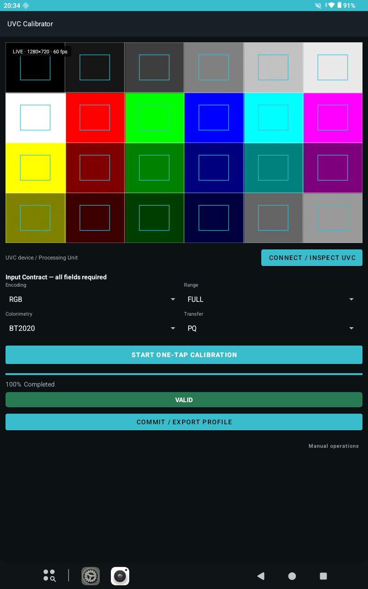

# Android UVC Calibrator

> **Experimental** — Validation閾値、対応機器、Profile互換性は今後変更される可能性があります。

Android端末からUVCキャプチャデバイスを実測し、Processing Unit（PU）設定とRGB補正係数を生成するキャリブレーションアプリです。生成したCalibration Profileは、別APKのAndroid UVC Field Monitorで読み込み、プレビューとScopesへ適用できます。



## 現在の対象

- Android 8.0以降（minSdk 26）
- arm64-v8a
- USB Host対応Android端末
- UVC MJPEG 1280×720、60 fps
- MS2109 / MS2109S / MS2130系キャプチャデバイス
- SDRおよびPQ code-domainのキャリブレーション

対象機器であっても、VID/PID、ファームウェア、PU Descriptor、Android USB Host実装によって挙動が異なる場合があります。

## 実装済み機能

- UVC Processing Unit Descriptorの解析
- Brightness / Contrast / Saturation / HueのCapability取得
- PU値の書込みとGET_CURによる確認
- USBセッションを維持したままの測定処理
- MJPEG 1280×720フレームの取得とTurboJPEGによるデコード
- 6列×4行、計24パッチの自動測定
- 各パッチ中央50% ROIの複数フレーム統計
- 2-pass PU Auto Calibration
- RGB Offset＋3×3 Matrixの最小二乗Solve
- 独立フレームによるValidation
- Calibration Profile Format v1の保存とJSON Export
- 保存済みProfileの再起動時再読込
- `CALIBRATION_VALID`および`CALIBRATION_POOR_FIT`のProfile Commit
- 解像度、フレームレート、色域、伝達特性を識別できるProfileファイル名
- 測定、PU Auto Calibration、Matrix Solve、Validationの進捗表示
- 簡易UVCプレビュー、6×4パッチ境界、中央50% ROIガイド表示
- Calibration結果の`VALID` / `POOR FIT` / `WARNING`ステータスバー表示
- PU調整中の安全な測定完了タイミングでのPreview Snapshot更新

Phase 0のモジュール分離は行わず、単一アプリ構成で実装しています。

## キャリブレーション処理

```text
UVC Device検出
→ PU Capability確認
→ 24パッチ測定
→ PU Auto Calibration
→ Offset＋3×3 Matrix Solve
→ Validation
→ Profile Commit / Export
```

JPEGデコード後のYCbCrは、実機測定結果に基づきBT.601 limited-rangeとしてEncoded RGBへ復元します。Capture CalibrationではSDR GammaやPQ EOTFを適用せず、取得した非線形コード値の領域で補正係数を求めます。

## テストパターン

24パッチは画面全体を6列×4行に分割した構成です。ラベル、境界線、UI Overlayを含めないでください。アプリは各パッチの中央50%を測定します。

### SDRパターン表示

[display_24_patch_pattern.py](tools/display_24_patch_pattern.py)を使用します。

```powershell
py -3 tools/display_24_patch_pattern.py --list-displays
py -3 tools/display_24_patch_pattern.py --display 2
```

`Esc`で終了、`F11`でFullscreenを切り替えます。

### PQキャリブレーションパターン

[generate_24_patch_pq.py](tools/generate_24_patch_pq.py)を使用します。FFmpegの`zscale`と`libx265`が必要です。

```powershell
py -3 tools/generate_24_patch_pq.py `
  --mode pq-code `
  --output 24_patch_pq_code.mp4 `
  --duration 60 `
  --fps 60 `
  --print-values
```

`pq-code`は元の8-bit基準値を10-bit PQコードへ直接スケールします。Capture DeviceがPQコード値を維持しているか測定するキャリブレーション用途では、このモードを使用します。

```text
8-bit 128 → 10-bit PQ code 514
8-bit 192 → 10-bit PQ code 770
8-bit 230 → 10-bit PQ code 923
```

Tone Mappingやプレビューの見え方を確認する場合は、絶対輝度モードを使用します。

```powershell
py -3 tools/generate_24_patch_pq.py `
  --mode absolute-nits `
  --peak-nits 1000 `
  --output 24_patch_pq_1000nit.mp4
```

絶対輝度版をCapture Calibrationへ使用すると、アプリの期待コード値と入力コード値が一致しません。PQキャリブレーションには使用しないでください。

## 基本操作

1. Android端末へUVCキャプチャデバイスを接続します。
2. 対象の24パッチをHDMI入力へ表示します。
3. 実際の入力条件に一致するInput Contractの4項目を選択します。
4. `Start one-tap calibration`をタップし、Camera permissionとUSB permissionを許可します。
5. PU Auto Calibration、Matrix Solve、Validationが連続実行されます。
6. 結果を確認し、`Commit / export profile`でProfileを保存・Exportします。

個別のInspect、PU設定、Measure、Solve、Validationは画面下端の`Manual operations`から実行できます。

Input Contractの初期値はすべて未選択です。推測値や暗黙のデフォルトは使用せず、Profile保存前に4項目を明示的に選択してください。

測定中は、テストパターン、HDMI出力設定、Capture Mode、USB接続を変更しないでください。USB接続は一連の処理が終わるまで維持されます。

## Input Contract

Profile Commit前に次の条件を指定します。

| 項目 | 選択肢 |
|---|---|
| Input Encoding | `RGB` / `YCBCR_444` / `YCBCR_422` |
| Range | `FULL` / `LIMITED` |
| Colorimetry | `BT601` / `BT709` / `BT2020` |
| Transfer Characteristics | `SDR` / `PQ` |

これらはProfile Matching条件です。実際のHDMI送信側設定と一致する値を選択してください。アプリがHDMI InfoFrameやHDR Static Metadataから自動判定する機能は、現時点ではありません。

## Validation

現在の暫定基準は次のとおりです。

```text
補正後MAE              3以下
最大チャンネル誤差    12以下
Neutral Axis RMSE      4以下
Black Offset最大値     6以下
White誤差最大値       10以下
Matrix条件数        10000以下
補正後RMSEが補正前RMSEより小さいこと
```

結果ステータス：

- `CALIBRATION_VALID`：暫定基準を通過
- `CALIBRATION_POOR_FIT`：Fit品質が基準外。警告付きでCommit可能
- `CALIBRATION_CLIPPED`：測定でClippingを検出。Commit不可
- `CALIBRATION_UNSTABLE`：行列が不安定。Commit不可

暫定基準は製品要件として確定したものではありません。現在の実機結果は[Capture_Calibration_Validation_Results.md](docs/Capture_Calibration_Validation_Results.md)を参照してください。

## Calibration Profile

Profile Format v1には次の情報を保存します。

- Device VID / PID / Serial（取得可能な場合）
- MJPEG Pixel Format、Resolution、Frame Rate
- Input Encoding、Range、Colorimetry、Transfer Characteristics
- Brightness、Contrast、Saturation、Hue
- RGB Offset
- RGB 3×3 Matrix
- Validation結果と各種誤差
- Pattern、Solver、Calibration ModelのVersion
- UTC Timestamp

保存時は一時ファイルへ書き込み、`fsync`後に可能な限りAtomic Moveで既存Profileを置換します。詳細は[Capture_Calibration_Profile_Format_v1.md](docs/Capture_Calibration_Profile_Format_v1.md)を参照してください。

## Field Monitorへの適用

ExportしたJSONをAndroid UVC Field Monitorの`Import Profile`から選択します。Field MonitorはDevice Identity、Capture Mode、Input Contractを照合し、不一致の場合は推測適用せず`PROFILE_MODE_MISMATCH`として補正を無効化します。

適用順序は次のとおりです。

```text
Capture
→ Profile Match
→ PU Fixed Values
→ BT.601 limited YCbCrからR'G'B'へ復元
→ RGB Offset＋3×3 Matrix
→ Preview / Scopes
```

## ビルド

Android Studioでプロジェクトを開き、接続したarm64-v8a Android端末へ`app`を実行します。

主な構成：

- Kotlin / Android USB Host API
- C++17 / Android NDK
- libusb
- libjpeg-turbo / TurboJPEG
- CMake 3.22.1
- compileSdk / targetSdk 37
- minSdk 26

libusbとarm64-v8a用libjpeg-turboは`app/src/main/cpp/third_party`以下に含まれています。

## 既知の制限

- 簡易Previewは480×270、約10 fps表示で、測定・記録用途のフル品質Previewではありません。
- Capture ModeはMJPEG 1280×720p60に固定されています。
- HDMI Input Contractは手動指定です。
- SDRとPQで同一Profileを共有できるとは仮定しません。
- 同一VID/PIDでも個体差や内部処理差が存在する可能性があります。
- MS2109 / MS2109S / MS2130で同じPU Capabilityを仮定しません。
- SaturationまたはHueを公開しない機器では、そのControlを利用できません。
- `CALIBRATION_POOR_FIT` Profileは比較・調整用途を想定しており、品質保証済みではありません。
- Validation閾値は暫定値です。
- PQ Profileはコード値直接指定パターンで再測定する必要があります。

## 関連資料

- [ドキュメント索引](docs/README.md)
- [現行アーキテクチャ](docs/Architecture.md)
- [統合アーキテクチャ設計仕様](docs/Capture_Calibration_Integrated_Architecture_Design_Specification.md)
- [Phase 0～11実装計画](docs/Capture_Calibration_Implementation_Plan_Phase0-11.md)
- [Calibration Profile Format v1](docs/Capture_Calibration_Profile_Format_v1.md)
- [実機Validation結果](docs/Capture_Calibration_Validation_Results.md)

## ライセンス

プロジェクト本体は[MIT License](LICENSE)で公開します。

`app/src/main/cpp/third_party`以下のlibusbおよびlibjpeg-turboには、それぞれのライセンスが適用されます。配布条件と著作権表示は[THIRD_PARTY_NOTICES.md](THIRD_PARTY_NOTICES.md)を参照してください。
