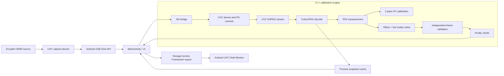
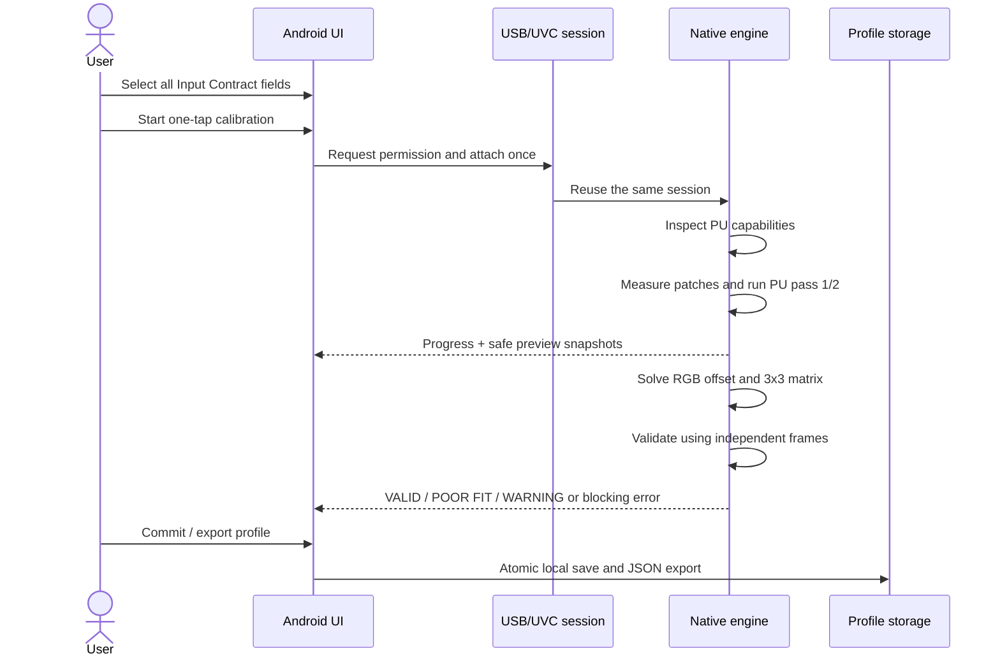
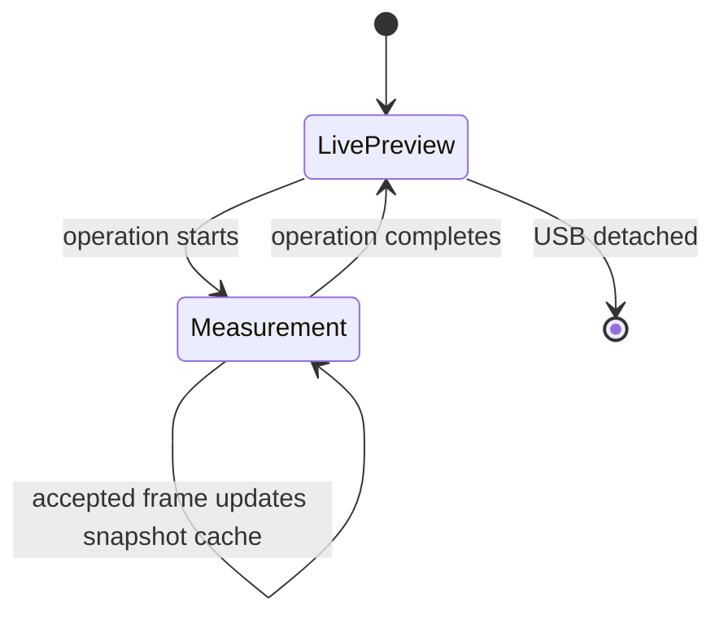

# Architecture

## Overview

Android UVC Calibratorは、Android USB Host APIで取得したUSB file descriptorを
JNIへ渡し、ネイティブ層でUVC制御、MJPEG取得、測定、補正係数の算出を行う
単一APKです。UIは入力条件の明示選択、ワンタップ実行、進捗、簡易プレビュー、
結果表示、Profile Exportを担当します。



## One-tap calibration sequence



The Input Contract has no default values. Input Encoding, Range, Colorimetry,
and Transfer Characteristics must all be selected intentionally before the
calibration can start or a Profile can be committed.

## Runtime boundaries

| Boundary | Responsibility | Main implementation |
|---|---|---|
| Android UI | Permissions, Input Contract, one-tap orchestration, progress, preview, result and export | `MainActivity.kt`, custom preview/result views, XML layouts |
| JNI | Kotlin/C++ API boundary and native lifetime | `native-lib.cpp` |
| USB/UVC | Descriptor parsing, PU controls, streaming and frame transfer | `uvc_device.*`, `uvc_stream.*` |
| Decode | MJPEG to RGB conversion using TurboJPEG | `uvc_mjpeg_decoder.*` |
| Measurement | 6×4 patch ROI statistics and frame acceptance | `measurement_engine.*` |
| Calibration | PU search, offset/matrix solve and progress reporting | `pu_auto_calibration.*`, `capture_solver.*`, `calibration_progress.*` |
| Validation | Quality metrics and commit eligibility | `validation_engine.*` |
| Profile | JSON generation and Profile Format v1 fields | `profile_engine.*`, `ProfileFileNaming.kt` |

## Preview and measurement coordination

Live preview is deliberately lightweight: the UI periodically copies a
480×270 ARGB snapshot from the native cache. During a calibration operation,
normal preview consumption is suspended so it cannot compete with measurement
for decoded frames. The measurement engine updates the same cache only at safe
frame-completion points, allowing the UI to show progress snapshots during PU
adjustment without taking ownership of the measurement frame.



## Profile hand-off

The exported JSON is not a universal correction. Android UVC Field Monitor
must match Device Identity, Capture Mode, and the complete Input Contract
before applying it. Matching profiles are applied in this order:

```text
Capture → Profile match → fixed PU values → BT.601 limited YCbCr decode
        → RGB offset + 3×3 matrix → Preview / Scopes
```

The format and matching rules are defined in
[Calibration Profile Format v1](Capture_Calibration_Profile_Format_v1.md).

## Third-party boundary

The native build statically includes a reduced libusb source set and an
arm64-v8a libjpeg-turbo archive. They are not relicensed under MIT; see
[Third-party notices](../THIRD_PARTY_NOTICES.md).
